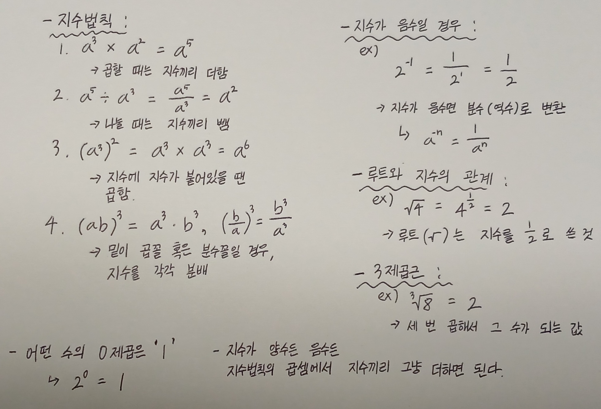
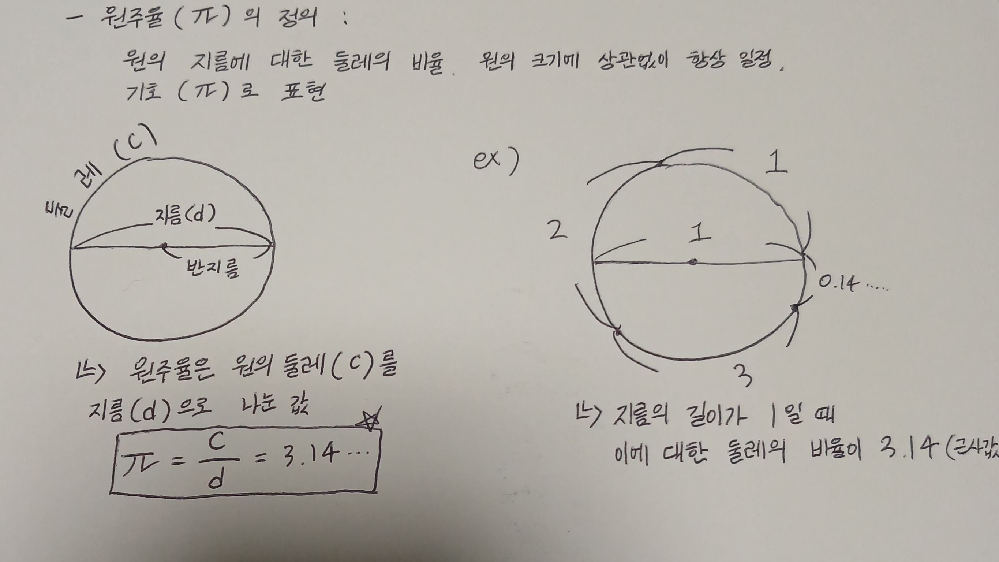
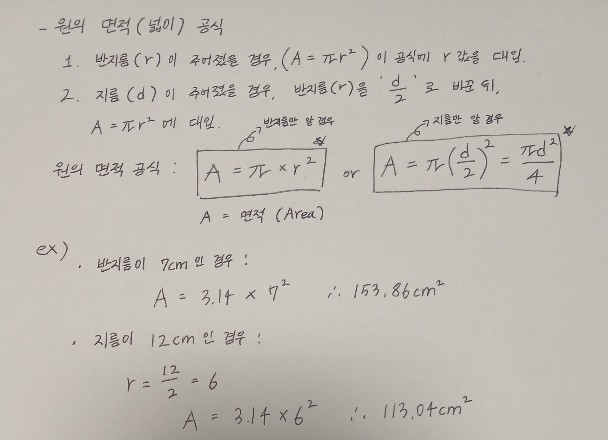
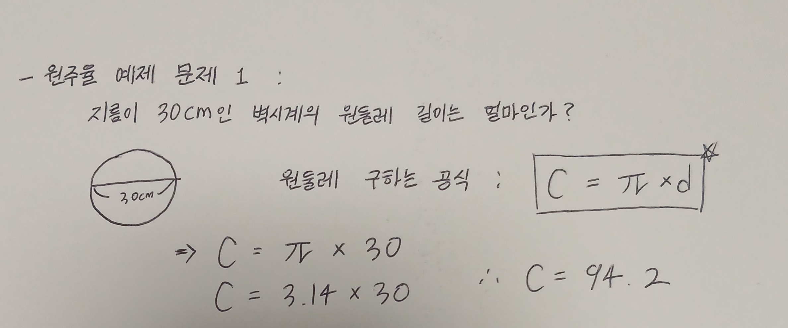
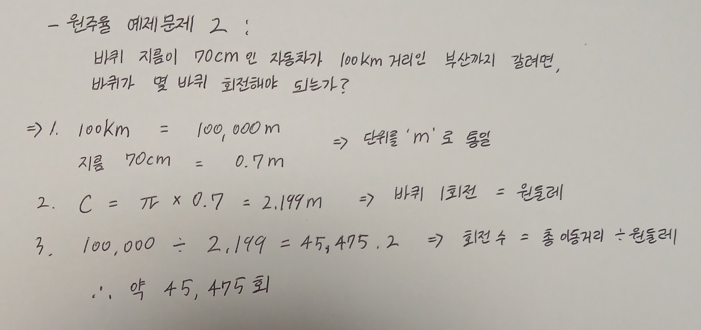
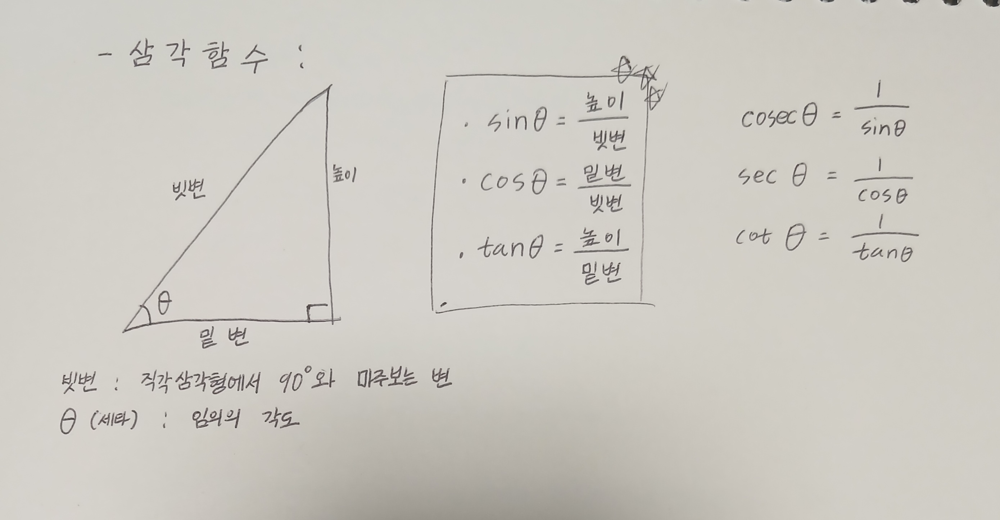

# 기초공학 수학 개념 정리  

## 목차
1. 기본 연산
2. 단위
3. 원주율
4. 디그리와 라디안
5. 삼각함수

## 기본 연산

- 지수법칙, 음수의 지수, 루트와 지수의 관계

## 단위

- 넓이, 부피, 가속도

1. 넓이  
1m * 1m = 1m²  
가로 * 세로

2.  부피  
1m * 1m * 1m = 1m³  
가로 * 세로 * 높이

3. 가속도  
매초 당 얼마만큼 속도가 증가하는지를 나타냄  
m/s²  
1초당 10m/s씩 속도가 증가할 때 가속도는 = 10m/s²

4. 중요한 변환  
- 1cm³ = 정육면체 부피  
- 1000cm³ = 1L
- 물 1L = 정육면체(10cm * 10cm * 10cm)

### (참고) 길이, 넓이, 부피 단위 환산

- 1cm = 10mm
- 1m = 100cm
- 1km = 1000m  
km > m > cm > mm

- 넓이, 부피의 단위 환산도 위와 같이 하면 된다 
(넓이의 경우 제곱이 되어 있기 때문에 마지막에 2를 제곱하여 계산)
(부피는 3제곱이기 때문에 마지막에 3을 제곱하여 계산)

> 1cm를 1m로 변환할 경우, 1cm는 1m보다 100배 작기 때문에, 소수점을 왼쪽으로 2칸 이동하여 0.01m가 된다  

> 1cm²를 1m²로 변환할 경우, 넓이는 2제곱이기 때문에 (100 * 100 = 10000) 4칸 이동하여 1cm²은 0.00001m² 로 환산된다.

> 부피도 넓이와 마찬가지로 변환시 3제곱을 하여 결과값을 도출한다.

## 원주율

- 원주율의 정의, 원주율 공식

원주율 (π)의 정의  

원의 면적 (넓이) 공식  

원주율 예제 문제 1  

원주율 예제 문제 2  

> 참고 : 지름 구하는 공식 : d = C / π  
> 삼각형의 넓이 : (밑변 * 높이) / 2

## degree 와 radian

- **degree (도)** :
우리가 평소 쓰는 각도 (360°)

- **radian (호의 길이로 각도 표현)** :  
360° = 2π  
180° = π  
라디안은 각도를 수로 바꾼 것  
삼각함수에서 각도를 수로 바꿔서 사용하기 위해 사용

- **변환 공식**  
라디안 = (도 × π) / 180  
도 = (라디안 × 180) / π  

- 변환하는 다른 방법  
라디안을 도로 바꿀 때 라디안에 57.3을 곱함  
도를 라디안으로 바꿀 때는 도에 57.3을 나눔

- 자주 쓰는 특수각의 라디안 변환   
0°   = 0  
30°  = π/6  
45°  = π/4  
60°  = π/3  
**90°  = π/2**  
**180° = π**  
270° = 3π/2  
**360° = 2π**

## 삼각함수

- 삼각함수

>참고  
>sin 30° = 1 / 2  
>sin 45° = √2 / 2   
>sin 60° = √3 / 2  
  
  >cos 30° = √3 / 2  
  >cos 45° = √2 / 2  
  >cos 60° = 1 / 2  
     
>tan 30° = 1 / √3  
>tan 45° = 1  
>tan 60° = √3
> - 표에 나와있는 것 외의 각도를 구해야할 때에는 아크 삼각함수를 사용 (사람이 계산하는거 거의 불가능해서 공학용 계산기로 계산)

